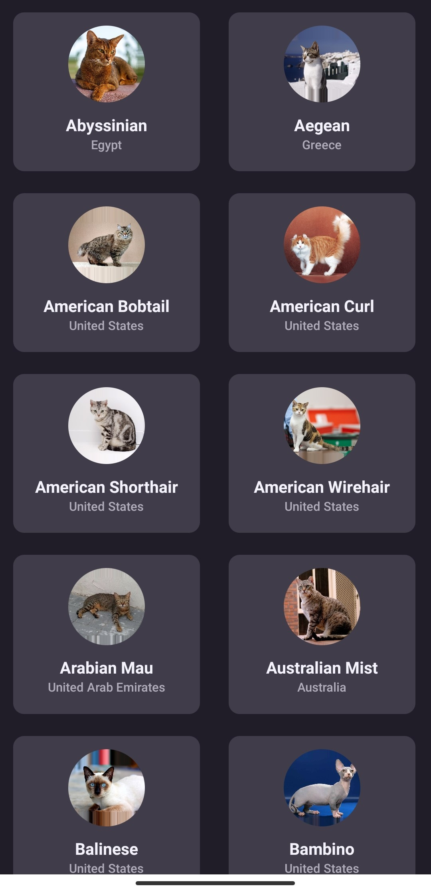

## The Problem

Since I first began using React Native, I have encountered this warning at least a dozen times, or maybe you too:

```bash
VirtualizedList: You have a large list that is slow to update — make sure your renderItem function renders components that follow React performance best practices like PureComponent, shouldComponentUpdate, React.memo, useCallback, useMemo etc.
```

Right, it seems familiar isn't it? This typically occurs when we load up a FlatList with lots of items that aren't just static text or images but instead have components with animations or data from third party api or other interactions.

## Why FlashList?

The listing interface used by `FlatList`, which is based on ScrollView, is termed VirtualizedList. Under the hood, VirtualizedList makes use of a rendering API that renders an enumerable list of items as a scroll. Perhaps because we use the newest iPhone and effortlessly post to Instagram every day, we don't see it. Even if everything appears to be in order, you can still encounter this problem if your project runs on low-end devices, particularly Android ones. Simply put, in order to figure it out, such strategies also require some computations.

Here comes to rescue `FlashList`, An alternative to FlatList that uses the UI thread and, according to their website, is 10 times quicker in JS and 5 times faster in JS thread. These performance gains are pretty impressive, even if only half the improvement is taken into account.

## Initializing React Native App

We will use **React Native CLI** to create our app. Make sure to check out their [installation guide](https://reactnative.dev/docs/environment-setup) if you haven't. I will be using TypeScript in this project.

To get started run this command :

```bash
npx react-native init InfiniteScroll --template react-native-template-typescript
```

Now wait until the installation is finished and then navigate to that directory.

```bash
cd InfiniteScroll
```

## Installing Dependencies

We will be using `React Navigation` in the project.Install the dependencies by running the command below. Here i'm using yarn you can use npm too.

```bash
yarn add @shopify/flash-list react-query @react-navigation/native react-native-screens react-native-safe-area-context @react-navigation/native-stack
```

## Setting up React Query

In order to use react-query in our project we need to setup some things. So, open you App.tsx file and add the following code.

```js
import React from 'react';
import { StatusBar, StyleSheet, View } from 'react-native';
import { QueryClient, QueryClientProvider } from 'react-query';

const queryClient = new QueryClient();

const App = () => {
  return (
    <QueryClientProvider client={queryClient}>
      <StatusBar barStyle="light-content" backgroundColor="#201d29" />
      <View style={styles.container}>
        <Text>Hello, World</Text>
      </View>
    </QueryClientProvider>
  );
};

const styles = StyleSheet.create({
  container: {
    flex: 1,
    width: '100%',
    height: '100%',
    backgroundColor: '#201d29',
  },
});

export default App;
```

> Note: I wont be covering the styling part. You can add your own styles or copy mine.

## Creating Components

Now before moving ahead let's setup `React Navigation`. First create a folder `src` in the root of the project. Then create two new folders `navigation` and `screens` in `src`. In the navigation folder add two files `AppNavigation.tsx` and `RootNavigation.tsx`. `RootNavigation.tsx` will contain the NavigationContainer and the Stack Navigator exported from `AppNavigation.tsx`. Now add 2 files in the `screens` folder, `Cats.tsx` and `Cat.tsx` and export a default component from each file. Now add the following code in both `AppNavigation.tsx` and `RootNavigation.tsx`.

In `AppNavigation.tsx` :

```js
import { createNativeStackNavigator } from '@react-navigation/native-stack';
import React from 'react';
import { CatType } from '../components/Cats/types';

import CatScreen from '../screens/Cat';
import CatsScreen from '../screens/Cats';
import HomeScreen from '../screens/Home';

export type AppStackParams = {
  HomeScreen: undefined;
  CatsScreen: undefined;
  CatScreen: CatType;
};

const AppStack = createNativeStackNavigator<AppStackParams>();

const AppNavigation = () => {
  return (
    <AppStack.Navigator
      screenOptions={{ headerShown: false, animation: 'slide_from_right' }}>
      <AppStack.Screen name="HomeScreen" component={HomeScreen} />
      <AppStack.Screen name="CatsScreen" component={CatsScreen} />
      <AppStack.Screen name="CatScreen" component={CatScreen} />
    </AppStack.Navigator>
  );
};

export default AppNavigation;
```

In `RootNavigation.tsx` :4

```js
import { DefaultTheme, NavigationContainer } from '@react-navigation/native';
import React from 'react';
import AppNavigation from './AppNavigation';

const theme = Object.freeze({
  ...DefaultTheme,
  colors: {
    ...DefaultTheme.colors,
    background: '#201d29',
  },
});

const RootNavigation = () => {
  return (
    <NavigationContainer theme={theme}>
      <AppNavigation />
    </NavigationContainer>
  );
};

export default RootNavigation;
```

Update the `App.tsx` file with the following code :

```js
import React from 'react';
import { StatusBar, View } from 'react-native';
import { QueryClient, QueryClientProvider } from 'react-query';
import RootNavigation from './src/navigation/RootNavigation';

const queryClient = new QueryClient();

const App = () => {
  return (
    <QueryClientProvider client={queryClient}>
      <StatusBar barStyle="light-content" backgroundColor="#201d29" />
      <View style={styles.container}>
        <RootNavigation />
      </View>
    </QueryClientProvider>
  );
};

const styles = StyleSheet.create({
  container: {
    flex: 1,
    width: '100%',
    height: '100%',
    backgroundColor: '#201d29',
  },
});

export default App;
```

## Creating Components

Navigation looks okay so to get started let's first create some components. First create a directory called `src` in your root folder. Inside `src` create two new folders `components` and `hooks`. Now create a folder `Cats` inside `components` and inside that create `index.jsx` and `CatCard.jsx` file.

In `CatCard.tsx` add the following code :

```js
import React from 'react';
import { useNavigation } from '@react-navigation/native';
import { NativeStackNavigationProp } from '@react-navigation/native-stack';
import { Image, StyleSheet, Text, TouchableOpacity, View } from 'react-native';

import { AppStackParams } from '../../../navigation/AppNavigation';
import { CatType } from '../types';

const CatCard: React.FC<{ item: CatType; index: number }> = ({
  item,
  index,
}) => {
  const { image, name, origin } = item;
  const navigation = useNavigation<NativeStackNavigationProp<AppStackParams>>();

  return (
    <View>
      <TouchableOpacity
        style={styles.container}
        activeOpacity={0.8}
        onPress={() => navigation.navigate('CatScreen', item)}>
        <Image
          source={{ uri: image.url }}
          resizeMode="center"
          style={styles.image}
        />
        <Text style={styles.name}>{name}</Text>
        <Text style={styles.origin}>{origin}</Text>
      </TouchableOpacity>
    </View>
  );
};

const styles = StyleSheet.create({
  container: {
    width: 170,
    padding: 12,
    borderRadius: 10,
    marginBottom: 20,
    backgroundColor: '#403c4a',
    alignItems: 'center',
    justifyContent: 'center',
  },
  image: {
    width: 70,
    height: 70,
    borderRadius: 80,
  },
  name: {
    color: '#f4f2fb',
    fontSize: 16,
    fontWeight: 'bold',
    marginTop: 10,
  },
  origin: {
    color: '#b1acb9',
    fontSize: 12,
    fontWeight: '600',
    marginBottom: 5,
  },
});

export default CatCard;
```

Here we're importing `CatTpe` from `types` folder. So add a types folder and a `index.ts` file and add the following code :

```js
export type CatType = {
  id: string,
  name: string,
  origin: string,
  description: string,
  life_span: string,
  temperament: string,
  adaptability: number,
  child_friendly: number,
  stranger_friendly: number,
  wikipedia_url: string,
  image: {
    width: number,
    height: number,
    id: string,
    url: string,
  },
};
```

In `index.tsx` file put the following code :

```js
import { FlashList } from '@shopify/flash-list';
import React from 'react';

import CatCard from './CatCard';
import { CatType } from './types';

type CatsPreviewProps = {
  catsData: any[] | undefined | CatType[],
  loadMoreCats: () => void,
  isFetching: boolean,
};

const CatsPreview: React.FC<CatsPreviewProps> = ({
  catsData,
  loadMoreCats,
  isFetching,
}) => {
  return (
    <FlashList
      data={catsData}
      renderItem={({ item, index }: { item: CatType, index: number }) => (
        <CatCard item={item} key={item.id} index={index} />
      )}
      keyExtractor={item => item.id}
      numColumns={2}
      estimatedItemSize={190 * 15}
      refreshing={isFetching}
      onRefresh={loadMoreCats}
      onEndReached={loadMoreCats}
      onEndReachedThreshold={0.1}
      contentContainerStyle={{ paddingVertical: 12 }}
    />
  );
};

export default CatsPreview;
```

In the above code we're accepting `catsData`, `loadMoreCats` and `isFetching` as props. To break it down `catsData` is the data that will be shown in the screen. When scroll position reaches the threshold value, a function to load new data can be called. In React Native, the threshold value ranges from 0 to 1, with 0.5 serving as the default. In above code we have used the function `loadMoreCats` which will be used to fetch cats when scrolling. FlashList provides `RefreshControl` which can be used show to a loading indicator while fetching data. To use it we need to provide two props to `FlashList`, `refreshing` and `onRefresh`. `refreshing` is boolean property and `onRefresh` is a callback function which will be called while fetching. For `refreshing` we got `isFetching` and for `onRefresh` we have `loadMoreCats`.

## Fetching Data

To fetch data we will utilize a custom hook. To get started create a file `useCats.ts` inside `hooks` directory. We will be fetching data from the [Cats API](https://thecatapi.com) and will use the `useInfiniteQuery` hook from react-query. `useInfiniteQuery` hooks accepts the same arguments as `useQuery`. First one is an array of unique keys, second is a fetcher function which will fetch the data and third is an optional object with some properties.

Inside `useCats.ts` file add the following code :

```js
import { useInfiniteQuery } from 'react-query';

const fetcher = async (pageNumber: number = 0) => {
  try {
    const response = await fetch(
      `https://api.thecatapi.com/v1/breeds?limit=20&page=${pageNumber}`,
    );
    const data = await response.json();
    return { data, nextPage: pageNumber + 1 };
  } catch (error) {
    if (error instanceof Error) throw new Error(error.message);
    else throw new Error('Something went wrong.');
  }
};

export default function useCats() {
  const {
    data,
    isError,
    isLoading,
    error,
    isFetching,
    hasNextPage,
    fetchNextPage,
  } = useInfiniteQuery(['dogs'], () => fetcher(), {
    getNextPageParam: ({ nextPage }) => nextPage,
    staleTime: Infinity,
  });

  return {
    data,
    isError,
    isLoading,
    error,
    isFetching,
    hasNextPage,
    fetchNextPage,
  };
}
```

In the above code the `fetcher` function accepts an argument `pageNumber` to paginate the data form the api. The returned data is also modified, which is an object containing the keys data and nextPage. Every time an API call is successful, nextPage is increased. This format of the data is required by useInfiniteQuery. The response we received from the `fetcher` method is passed as the lastPage parameter, which is accepted by getNextPageParam, which then returns the subsequent page. `useInfiniteQuery` returns several additional methods to us. There are now functions `fetchNextPage` and a boolean property `hasNextPage` which indicates if we can make more query.

## Combining everything

The data format returned by `useInfiniteQuery` is an object with two keys:

- pageParams - an array of the page number
- pages - an array of our data for each page

In order to map through the data for each page as an array and render them, we must flatten the pages first. We can use the flatMap method.

```js
const catsData = data?.pages.flatMap(page => page.data);
```

Open the `Cats.tsx` file inside `screens` folder and add the following code :

```js
import React from 'react';
import { StyleSheet, Text, View } from 'react-native';

import CatsPreview from '../../components/Cats';
import useCats from '../../hooks/useCats';

const CatsScreen = () => {
  const { isError, data, error, fetchNextPage, hasNextPage, isFetching } =
    useCats();

  const catsData = data?.pages.flatMap(page => page.data);
  const loadMoreCats = () => hasNextPage && fetchNextPage();

  return (
    <View style={styles.container}>
      {isError && (
        <Text style={styles.error}>
          {error instanceof Error ? error.message : 'Something went wrong'}.
        </Text>
      )}
      <CatsPreview
        catsData={catsData}
        isFetching={isFetching}
        loadMoreCats={loadMoreCats}
      />
    </View>
  );
};

const styles = StyleSheet.create({
  container: {
    height: '100%',
    width: '100%',
    marginLeft: 12,
  },
  error: {
    color: '#ffe742',
    fontSize: 18,
    fontWeight: '600',
    textAlign: 'center',
    marginVertical: 20,
  },
});

export default CatsScreen;
```

After everything our app should look something like this :



It's kind of good but when the app first loads we get a non pleasant layout shift. To fix this lets first add a npm package `react-native-animatable` :

```bash
yarn add react-native-animatable
```

Now open the `CatCard.tsx` file and update with the following code :

```js
import React from 'react';
import { useNavigation } from '@react-navigation/native';
import { View as AnimatedView } from 'react-native-animatable';
import { Image, StyleSheet, Text, TouchableOpacity } from 'react-native';
import { NativeStackNavigationProp } from '@react-navigation/native-stack';

import { AppStackParams } from '../../../navigation/AppNavigation';
import { CatType } from '../types';

const CatCard: React.FC<{ item: CatType; index: number }> = ({
  item,
  index,
}) => {
  const { image, name, origin } = item;
  const navigation = useNavigation<NativeStackNavigationProp<AppStackParams>>();

  return (
    <AnimatedView animation="slideInUp" duration={500} delay={index}>
      <TouchableOpacity
        style={styles.container}
        activeOpacity={0.8}
        onPress={() => navigation.navigate('CatScreen', item)}>
        <Image
          source={{ uri: image.url }}
          resizeMode="center"
          style={styles.image}
        />
        <Text style={styles.name}>{name}</Text>
        <Text style={styles.origin}>{origin}</Text>
      </TouchableOpacity>
    </AnimatedView>
  );
};

const styles = StyleSheet.create({
  container: {
    width: 170,
    padding: 12,
    borderRadius: 10,
    marginBottom: 20,
    backgroundColor: '#403c4a',
    alignItems: 'center',
    justifyContent: 'center',
  },
  image: {
    width: 70,
    height: 70,
    borderRadius: 80,
  },
  name: {
    color: '#f4f2fb',
    fontSize: 16,
    fontWeight: 'bold',
    marginTop: 10,
  },
  origin: {
    color: '#b1acb9',
    fontSize: 12,
    fontWeight: '600',
    marginBottom: 5,
  },
});

export default CatCard;
```

## Conclusion

Now that I believe React Query and FlashList is more capable and will become more well-liked by the community, I believe, other developers to can give it a shot.

Repo link [React Query Infinite Scroll](https://github.com/iamNilotpal/infinite-scroll)
